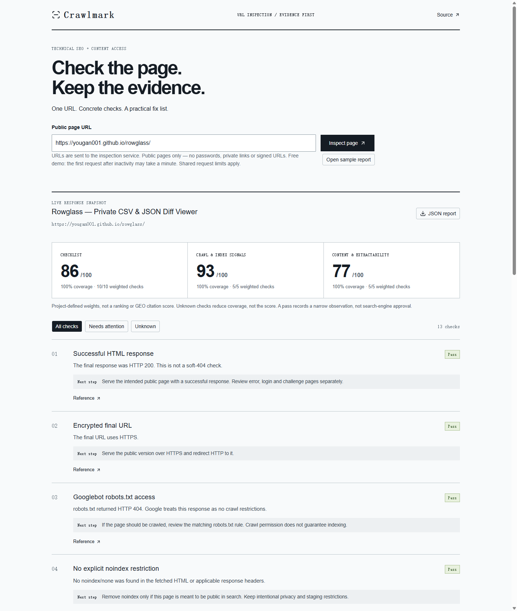

# Crawlmark

A small URL inspection service for technical SEO and content-access reviews. Get evidence, a transparent checklist score and a fix list from one public page — without pretending to know its ranking or citation probability.

**[Try the live demo](https://yougan001.github.io/crawlmark/)** — enter a public URL for a real inspection, or open the local sample. The interface is hosted on GitHub Pages; a separate Node service performs the inspection. The free demo can take about a minute to wake up and has shared request limits. For sustained use, run your own instance.



The screenshot shows a real URL inspection through the public demo. The separate sample is explicitly labeled and evaluated locally by the same report engine.

## What it inspects

- Final HTTP status and redirect chain.
- Googlebot robots.txt rules, noindex and snippet restrictions in HTML and response headers.
- Canonical hints, title, description, source headings and text availability.
- Existing JSON-LD syntax and image alt attributes.
- Thirteen checks with evidence, a next step and reference links. Unknowns lower coverage, not the score. Blocking restrictions remain visible regardless of score.

This is a **single-response, source-only** inspection. It does not execute scripts, measure Core Web Vitals, check search-index membership, audit backlinks or certify schemas. See [the scoring method](docs/method.md).

## Run the API

Node 22.13+ is required.

```sh
npm ci
npm test
npm run api
```

The default listener is `127.0.0.1:8787`. Send `POST /api/inspect` with `Content-Type: application/json` and a body such as:

```json
{ "url": "https://example.com/" }
```

The response is a versioned JSON report. Errors have `{ "error": { "code", "message" } }`. `GET /health` returns the service name and API version. No inspection history is stored.

## Network boundaries

Only public HTTP/HTTPS on default ports. Private/special-use addresses are rejected, every DNS answer is validated, and the connection is pinned to a checked IP with TLS hostname verification. Each redirect is checked again. Requests, response bodies, parse time and concurrency are bounded.

The API is **local-only by default**. Before exposing it, read [security and deployment notes](docs/security.md): use network isolation, TLS and appropriate authentication/abuse controls. CORS is not authentication. Never submit private links, credentials or signed URLs.

## Development

In a second terminal, run the frontend:

```sh
npm run dev -- --port 5184
```

Open `http://localhost:5184`. The development server proxies `/api/inspect` to the loopback Node service. Use the URL form for a real inspection, or open the local sample. Findings can be filtered to issues/reviews or unknown checks; JSON export contains the complete report regardless of the current filter.

For a production static build, set `VITE_INSPECTION_API` to the full HTTPS inspection endpoint before `npm run build`. The backend must allow the frontend origin. Without it, the URL button stays disabled and the page clearly says only the sample is available. Set `GITHUB_PAGES=true` for the `/crawlmark/` base path. The included Pages workflow reads its endpoint from repository Actions variables; it does not host the API. See [deployment.md](docs/deployment.md) for Render setup, cold starts and the demo's shared limits.

`core/` contains deterministic report logic. `server/` owns networking, quotas and disposable parser workers. `app/` is the report desk, and `workers/` analyzes the sample locally. `tests/` contains policy, streaming and API regressions.

For bug reports, include sanitized HTML/robots examples, expected behavior and the actual finding. Never post secrets or private URLs in issues. [Testing notes](docs/testing.md) distinguish fixtures from real browser checks.

MIT licensed. Dependency licenses remain in their packages; see [third-party notices](THIRD_PARTY_NOTICES.md).
